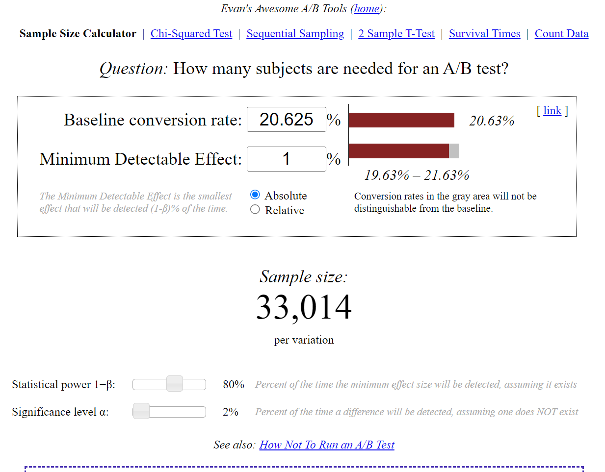
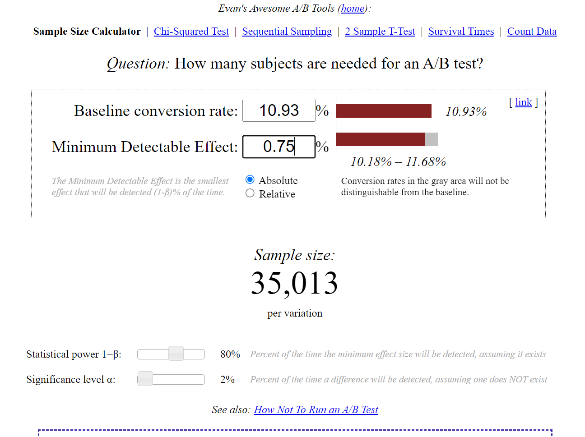

## **$\textcolor{brown}{Business\ Goal}$**
就像 Instruction 里面说的，通过增加新功能，我们期望：
 * 增善学生体验，减少因为时间不够而中途退出 free trial 的学生数量。使 coaches 得到更好的分配，有更充足的时间和精力服务可能完成课程的学生。
 * 不会过多减少那些通过 free trial 并且最终完成课程的人数，不会大幅减少平台盈利。


## **$\textcolor{brown}{Metric\ Choice}$**
## **$\textcolor{grey}{Invariant\ Metrices}$**
 * **Number of cookies:** 这个是分组的依据，实验组与对照组除了新增功能的不同，其余应该保持统一，包括样本量，即这里的 cookies 。
 * **Number of clicks:** 点击 "Start free trial" 按钮的人数，这个是发生在 free trial trigger 之前的，所以实验组与对照组应保持统一，以防其他因素或者改变影响了实验效果。
 * **Click-through-probability:** `点击 "Start free trial" 按钮的人数`比上`浏览主页的人数`。这个指标比上面的更好，考虑到了分母即两组的 cookies 基数。但我还不知道实际需要这个和上面的指标都考虑么？只考虑这个点击率和两组基数 cookies 就可以了？因为看起来点击率和基数确定了，上一个指标就也确定了。或许也不用考虑这么多，都看一下就完事了。


## **$\textcolor{grey}{Evaluation\ Metrices}$**
 * **Number of user-ids:** 实验组里面这个数值应该会减少，但这不是一个比较好的指标，我们更倾向于选择比率类的指标。
 * **Gross conversion:** 这正是我们想要衡量的指标，分子是决定参加 free trial 计划的人数，在看到了我们的 trigger 之后仍然选择参加 free trial 的人数，分母是点击了 "Start free trial" 的人数，注意这里的点击是在我们的 trigger 出现之前。
 * **Retention:** 这不是一个好指标因为需要的时间太长了，分子需要至少 14 天以后才能收集到信息，我们整个实验就要拖得很长，还要去除掉前面14天的数据，做 cohort analysis 等等。如果要测的话我们会期望这个指标减少，因为 trigger 赶走了一些心不诚的人，剩下注册了的会更倾向于 pass 14-day boundary 。
 * **Net conversion:** 这个指标跟上面一个指标一样，都存在数据收集时间过长的问题。如果要计算这个指标的话，期待在实验组会减少，因为部分人被 trigger 后选择不 enroll 。

还有一些指标我觉得 instruction 里面没写出来的，因为 business goal 里面提到了 coach 相关的事情，我们做了实验也期望可以使 coach 资源得到更合理且高效的分配。我现在能想到的指标包括互动率，比如平均每人每天与 coach 交流的次数或者时长，但这个指标可能非常的稳定，出现了变化极大程度上会是由于我们实验设置上的问题而不是真的由于我们的新功能，要具体的看一下。还有一个指标是 coach 这方面两组平均每天上线时长或者与学生交流次数，指标存在的问题也跟前面一个一样。  

指标产生怎样的变化我才会上线新功能？  
我会选择 **Gross conversion** 和 **Net conversion** 两个 Evaluation Metric 指标。前两个指标里面选择点击率而不是点击量指标，后两个选择 **Net conversion** 因为这个指标穿越的漏斗指标层级之间包括了我们的 trigger，但是后面这两个指标还是存在计算时间过长的问题。如果我们有足够的时间的话，我们期望这两个指标在实验组都要上涨。


## **$\textcolor{brown}{Measuring\ Variability}$**
对于指标 **Gross conversion**，我们用 Enrollments per day (660) 除以 Unique cookies to click "Start free trial" per day (3200)，算得 0.20625。Variability 是 $\sqrt(p(1-p)*(2/N))$，这里 p 是 0.20625，N 是单组的样本量。因为我们分组用的是 cookies，计算指标的时候只能用 cookies 或者 event_based clicks。对于指标 **Net conversion**，我们用 "Probability of payment, given click"，数值是 0.1093125，variability 的计算方式与上面一个指标相同。因为我们要追踪用户，计算指标时候要用 cookies 而不是 event_based clicks，而且两个指标都是去重的点击率，可以用正态分布模拟，所以不用计算 empirical variance。


## **$\textcolor{brown}{Sizing}$**
我们选择的两个 evaluation metrices 之间有很大的相关性，可用 bonferroni correction 来进行修正，即选择 $\frac{\alpha}{2}=0.025$ 来作为每个 metric 的 alpha 值。通过样本量计算网站得到两个指标需要的样本量结果如下：







所以我们最后取 35013 样本量即可。


## **$\textcolor{grey}{Duration\ and\ Exposure}$**
如果我们要测量 **Net conversion** 指标的话，我们就需要很长时间的实验，至少要14天以上，才能测得有效数据进行计算。实验周期可以选4周。但这太久了，就像 Instruction 里面说的。所以不然就不去算 **Net conversion** 这个指标，想一想其他的指标来代替。我问了 Udacity 的 chatgpt，回答如下：  
```
对于你的情况，如果你希望在几周内进行短期的A/B实验并测量指标数据，可以考虑以下替代指标：

活跃用户比例：该指标可以通过计算每个实验组中的活跃用户数量与总用户数量的比例来衡量。
活跃用户可以定义为在一定时间范围内与产品进行交互的用户。这个指标可以更快地反映用户对产品的兴趣和参与度。

转化率：转化率是指用户从一个阶段转移到下一个阶段的比例。
例如，你可以关注用户从注册到完成某项操作（如购买、订阅等）的转化率。这个指标可以帮助你了解用户在关键行为上的表现。

平均访问时长：这个指标可以衡量用户在产品上的停留时间。
通过比较实验组和对照组的平均访问时长，你可以了解到用户对不同版本的产品的使用习惯和偏好。

这些替代指标可以在较短的时间内收集数据，并提供有关用户体验的有用信息。
当然，选择适合你实验目标的指标时，要确保它与你的研究问题和产品目标相一致。你可以根据实际情况选择一个或多个指标来评估实验结果。
```

对于实验时长和周期的考虑，还要看用户群体。是上班族？那实验周期就一定要包括周末，因为上班族一般周末学习的时间比较多。是学生党？那就要看实验的时间是不是学生放假的时候？考试周？等等。  


## **$\textcolor{brown}{Analysis}$**
## **$\textcolor{grey}{Sanity\ Checks}$**
首先进行 sanity check，我们选择的 invariant metrices 有 **Number of cookies**， **Number of clicks** 以及 **Click-through-probability**。  
 * **Number of cookies:** 计算实验组和对照组的 cookies (pageviews) 总数，分别为 344,660 和 345,543。我们假设用户是会平均随机分配在实验组和对照组两边的，那么就像抛硬币一样这应该符合概率为 1/2 的二项分布，样本量足够大的时候 (NP=(344660+345543)*1/2>5 & N(1-P)=(344660+345543)*1/2>5) 可以用正态分布近似模拟。标准差是 $\\sqrt{P(1-P)*(1/N)} = \\sqrt{1/4*(1/(344660+345543))}=0.000602$，margin of error 是 $1.96*0.000602=0.001180$，所以 95% 置信区间是 $[0.5-0.001180, 0.5+0.001180]$ 即 $[0.49882,0.50118]$。而我们计算一下我们的实验组 cookies 占比，是 $344660/(344660+345543)=0.499360$，在我们的置信区间内，所以实验分析可以继续进行。Sanity check 但凡有一个不符合的我们就要停止实验分析看哪里出了问题。我们可以逐天的对比，看是不是，比如实验组的人数总是比对照组多或者少？有哪天是人数分配最不均匀的？周末与周中分配情况一样么？等等。
 * **Number of clicks:** 同上，28378 和 28325。SD 标准差是 $\\sqrt{1/4*(1/(28378+28325))}=0.002100$，95%置信区间是 $[0.495884,0.504116]$，clicks 占比是 $0.500467$，在我们的置信区间内。
 * **Click-through-probability:** 这个指标按理说，前两个指标 sanity check 都做好了，这个指标的 sanity check 就也符合了。但我们还是再算一下，因为这里不是像上两个指标那样的 count。我们算得实验组和对照组的点击概率分别是 $28325/344660=0.082182$ 和 $28378/345543=0.082126$，整个 standard pool 的点击概率是 $ p = (28378+28325)/(344660+345543) = 0.082154 $，而 standard pool 的标准差 standard error 是 $\sqrt{p(1-p)(1/344660+1/345543)}=0.000661$，所以95%置信区间是 $[-0.001296,0.001296]$，而实验组与对照组点击概率的差是 $0.082182-0.082126=0.000056$，在置信区间内，符合 sanity check。现在突然想起一个问题，这里可能会出现，比如前两个指标 (分子分母) 都符合 sanity check，但点击率不符合 sanity check 的情况么？


## **$\textcolor{grey}{Check\ for\ Practical\ and\ Statistical\ Significance}$**
因为指标之间相互关联，我们使用 Bonferroni correction 重新设置 α 为 $0.025$。计算两个指标的置信区间：
 * **Gross conversion:** 先算一下平均点击率 $\hat{p}$，计算的方法是用实验组与对照组 Enrollments 总数除以实验组与对照组 Clicks 总数，数值是 $0.2086$。再计算 Variance，是 $0.0044$。然后计算 $97.5%$ 置信区间，查表双侧检验（这里我觉得也可以用单侧检验，因为我们只关心正向的结果，但我不知道能不能用单侧检验）得 $2.24$。实验组与对照组的点击率差值是 $0.0206$。所以置信区间是 $[0.0206-2.24*0.0044,0.0206+2.24*0.0044]$ 即 $[0.010744,0.030456]$，置信区间全部在最小阈值 $0.01$ 以上，所以这个指标效果很好可以考虑上线。
 * **Net conversion:** 略同上，平均点击率算得 $0.1151$，Variance 是 $0.0034$，对照组与实验组的点击率差值是 $0.0049$，双侧检验 $97.5%$ 置信区间为 $[0.0049-2.24*0.0034,0.0049+2.24*0.0034]$ 即 $[-0.0027,0.0125]$，点击率的差比最小阈值小，但置信区间超过了最小阈值，却也包括负值，代表在 $97.5%$ 置信区间内，有可能我们的点击率是显著的，也有可能是非显著的甚至副作用。这里我们的建议可能是增大相关统计指标，比如 β、样本量 等，再进行迭代实验，观察是否能有更好的效果。


## **$\textcolor{grey}{Run\ Sign\ Tests}$**
 * **Gross conversion:** 我不确定这里我写的是否符合它想让我算的，因为题目里面说点击率差值的置信区间，听起来好像要算每天的点击率差，然后看有多少天在我们前文算的 $97.5%$ 置信区间内，但我这么算只有 9/23 在置信区间中，按照 $97.5%$ 概率算，23 条记录中出现 9 条正向的概率小于 $0.000%$ 后四位小数点，而正常应该如下这么算（课程里也是这么教的）：我们计算实验组点击率小于对照组的天数，如果实验组对照组没差距的话，天数应该在总天数的 $50%$ 左右，就像掷骰子，这应该符合概率为 $50%$ 的正态分布。我们实验的结果是在 23 天中有 9 天是点击率实验组小于对照组，用[这个网址](https://www.graphpad.com/quickcalcs/binomial2/) 可以测得，在平均概率为 $50%$ 事件中，23 次事件中有 9 次发生的概率是 $0.0026$ (双尾实验)。这小于了 $0.05$，说明了在 $95%$ 概率下，实际上实验组与对照组是产生了差异的。而我目前不知道计算点击率差在置信区间内次数比上总次数的做法是否正确或者应该怎么进一步分析，可能是我有点走火入魔了。
 * **Net conversion:** 略同上， 10/23，概率是 $0.6776$，说明大概率没差别。


## **$\textcolor{grey}{Make\ a\ Recommendation}$**
There is a significant difference between **Gross conversion**, which is defined as number of enrollments divided by clicks. However, there is no significant difference between **Net conversion**, which is defined as number of payments divided by clicks. I think this illustrates that although fewer people choose to enroll into the course in the experiment group, they are more likely to complete the free trial and make a payment. The number of payments are not significantly affacted and sales are not decreased dramatically in the experiment group hopefully. Thus users have a better course experiment which fullfills our business goal. Thus I think we should launch the experiment. Perhaps we should run additional experiments and consider revenue metrics as well.


## **$\textcolor{brown}{Follow-Up\ Experiment:\ How\ to\ Reduce\ Early\ Cancellations}$**
I want to add a function using LLM tools to provide coach services to students so that their questions can be solved in time, which will potentially reduce the number of frustrated students. For metrics to be claculated, first one comes to my mind is the number of early cancel students divided by total number of students. However, calculating this metric takes a lot of time which is hard to be done during an AB test. Alternative metrics come into my mind is the average time spent on the course everyday or retention, but these metrics need further inspect as well since they might be too robust.
